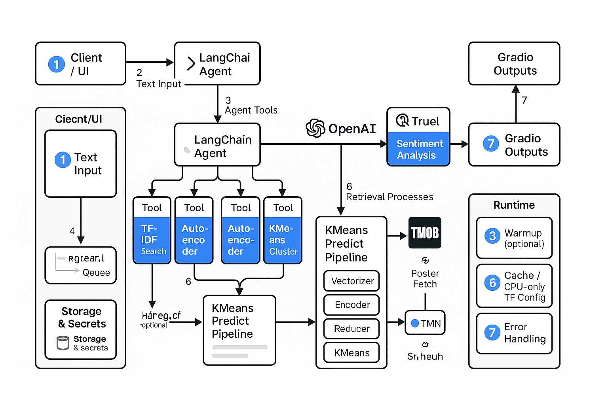

<h1>Movie recommendation system</h1>

This repository contains a Google Colab notebook (your_notebook_name.ipynb) that demonstrates the development and experimentation with various machine learning models for building a movie recommendation system. The project focuses primarily on content-based and hybrid approaches, utilizing movie metadata to provide recommendations in the absence of explicit user rating data.

<h2>Project Goal</h2>

This comprehensive study presents the development of an advanced, multi-modal movie recommendation system that integrates traditional machine learning approaches with cutting-edge artificial intelligence agents and sentiment analysis capabilities. The primary goal is to create a personalized, explainable, and scalable recommendation platform that addresses the limitations of existing single-algorithm approaches while providing users with meaningful insights into recommendation rationale.

<h2>Model Deployment and running from HF</h2>

***Movie Recommendation based on TF-IDF/AutoEncoder/KMeans*** https://huggingface.co/spaces/arupchakraborty2004/MovieRecommendationsV1 

***Movie Recommendation based on TF-IDF/AutoEncoder/KMeans using user sentiment and AI agentic flow using LangChain*** https://huggingface.co/spaces/arupchakraborty2004/MovieRecommendationSystemV2

<h2>Models Implemented</h2>
The notebook implements and experiments with the following recommendation models:

***Content-Based Filtering***: Using TF-IDF vectorization of movie metadata and cosine similarity to find similar movies.

***Hybrid Model***: Combining content similarity (from TF-IDF) with sentiment similarity (derived from movie overviews) using weighted averaging.

***k-Nearest Neighbors (kNN)***: Applied to the TF-IDF feature space for content-based nearest neighbor recommendations.

***Autoencoder***: A neural network for learning lower-dimensional latent representations of movie content features.

***Item-Based Clustering***: Using KMeans clustering on Autoencoder-learned latent features to group similar movies.

***Sentiment analysis*** On movie overviews is performed using the VADER tool from the NLTK library.

***Agentic*** An Agentic Flow using LangChain and OpenAI is also implemented to interpret natural language user input, detect sentiment, and utilize the recommendation models via defined tools.

<h2>Key Steps Covered</h2>
The project guides through the following stages:

***Data Loading and Preprocessing***: Loading movie metadata and credits, cleaning, and combining relevant features into a single text corpus ("soup").

***Sentiment Analysis***: Calculating sentiment scores for movie overviews using VADER.

***Content Representation***: Generating TF-IDF vectors and exploring Sentence Embeddings for movie content.

***Dimensionality Reduction (Autoencoder)***: Training and using an Autoencoder to learn latent features.

***Clustering (KMeans)***: Applying KMeans to content features (TF-IDF or latent features).

***Model Implementation***: Building content-based, hybrid, kNN, and clustering-based recommendation functions.

Hyperparameter Tuning & Feature Engineering: Experimenting with different parameters for TF-IDF, Autoencoder, kNN, KMeans, text preprocessing techniques (stemming, lemmatization), and incorporating additional metadata into the content features.

***Hybrid Model Refinement***: Experimenting with different weighting schemes for combining content and sentiment scores.

***Agentic Flow Implementation***: Building a LangChain agent that uses tools for sentiment detection (OpenAI) and accessing the recommendation models.

***Model Saving***: Demonstrating how to save trained models and components for potential deployment.

***Analysis and Summary***: Discussing model design, training procedures, optimization efforts, and reflecting on model performance (primarily qualitatively due to data limitations).

<h2>Data</h2>
The project uses the TMDB 5000 Movie Dataset. The necessary CSV files (movies.csv and credits.csv) should be placed in the /tmp directory or adjusted in the notebook's data loading cells.

<h2>Dependencies</h2>
The project requires standard Python libraries for data manipulation, machine learning, and natural language processing. Key libraries include:

pandas
numpy
scikit-learn
tensorflow or keras (for Autoencoder)
nltk (for VADER sentiment analysis)
spacy (for lemmatization experiments)
sentence-transformers (for sentence embeddings)
matplotlib (for plotting)
langchain
langchain-openai
joblib
These dependencies are installed using pip commands within the notebook cells.

<h2>Potential Future Work</h2>
Acquire and integrate user interaction data.
Implement collaborative filtering and more advanced hybrid recommendation models.
Perform rigorous quantitative evaluation using appropriate metrics.
Investigate and mitigate biases in the recommendation system.
Explore advanced content representation techniques.
Plan and implement steps to productionize the chosen model.
