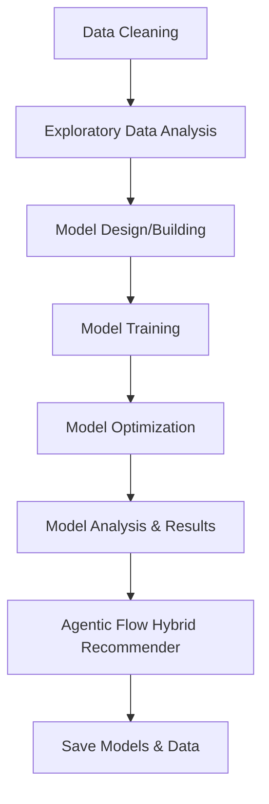

# Movie Recommendations & Sentiment Analysis - Split Python Modules

This repository contains Python modules split from the original Jupyter Notebook **AAI_Final_Project__Movie_Recommendations_And_Sentiment_Analysis.ipynb**.  
Each file corresponds to a specific stage of the project workflow, wrapped in a callable function for reusability.

## Project Structure

| File | Function | Description |
|------|----------|-------------|
| `data_cleaning.py` | `run_data_cleaning()` | Loads raw datasets, handles missing values, cleans text data, processes genres and keywords, and prepares datasets for analysis. |
| `exploratory_data_analysis.py` | `run_exploratory_data_analysis()` | Performs EDA on the cleaned datasets, including descriptive statistics, visualizations, and correlation checks. |
| `model_design_building.py` | `run_model_design_building()` | Defines and builds machine learning models including Autoencoder, KNN (Nearest Neighbors), and KMeans clustering. |
| `model_training.py` | `run_model_training()` | Trains the defined models on the processed data and saves intermediate artifacts. |
| `model_optimization.py` | `run_model_optimization()` | Performs model optimization, including hyperparameter tuning and fine-tuning steps for better performance. |
| `model_analysis_and_results.py` | `run_model_analysis_and_results()` | Evaluates trained models, generates performance metrics, and visualizes results. |
| `agentic_flow.py` | `run_agentic_flow()` | Executes the Agentic Flow hybrid recommendation pipeline (content + collaborative filtering blending). |
| `save_models.py` | *(script)* | Saves all trained models, vectorizers, embeddings, indices, and essential data for frontend/backend integration. |

---

## How to Use

### Install Required Dependencies
Ensure you have Python 3.8+ and install the dependencies used in the original notebook:

```bash
pip install -r requirements.txt
```

Example `requirements.txt`:
```
pandas
numpy
scikit-learn
matplotlib
seaborn
tensorflow
keras
sentence-transformers
joblib
```

###  Prepare Data
Place `movies.csv` and `credits.csv` in the working directory (or update file paths inside `data_cleaning.py`).

###  Run Workflow Steps
You can run each stage individually by importing and calling its function:

```python
from data_cleaning import run_data_cleaning
from exploratory_data_analysis import run_exploratory_data_analysis
from model_design_building import run_model_design_building
from model_training import run_model_training
from model_optimization import run_model_optimization
from model_analysis_and_results import run_model_analysis_and_results
from agentic_flow import run_agentic_flow

# Example execution order:
run_data_cleaning()
run_exploratory_data_analysis()
run_model_design_building()
run_model_training()
run_model_optimization()
run_model_analysis_and_results()
run_agentic_flow()
```

### Save Models for Deployment
After running all stages, execute:

```bash
python save_models.py
```

This will save all trained models and essential data into the `recommendation_models/` folder.

---

## Notes
- All functions were extracted **verbatim** from the original notebook — no additional logic was added.
- The order above reflects the logical project workflow.
- To run end-to-end, you may need to manage global variables or adapt outputs from one stage to be inputs to the next (as per original notebook variable usage).

---

## Recommended Workflow Diagram



---

## Support
If you encounter issues running these scripts, ensure:
1. The dependencies match the original notebook environment.
2. Dataset paths are correct.
3. Python version compatibility is maintained.
